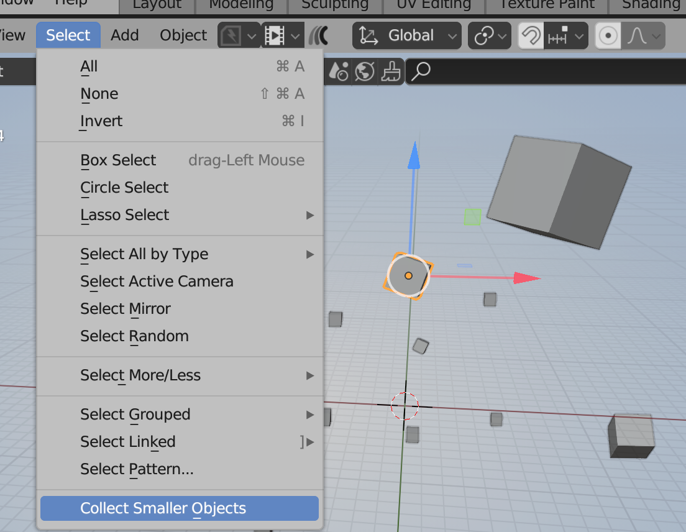

# Blender - Collect Smole Objects Addon

A Blender addon that collects and hides small objects by volume - perfect for cleaning up CAD imports.

## The Problem

This addon is mainly useful for people who have to deal with CAD data collections like automotive UDMs, product models, or architectural imports. Often these collections come in with a lot of parts you don't need because they fell through the cracks or something when someone was exporting...things like screws and springs and whatnot that you won't see when rendering. Sometimes these can be very dense, adding bulk that you don't want - and/or can't afford - in your scene. You don't want a small bolt taking up more polys than your whole hood.

The challenge? A threshold that works for a Sony Walkman won't work for a car. What works for a car won't work for a building. We need something smarter.

## Current Version (v1.1)

**Simple and functional:**
- Select ONE mesh object as your reference size
- Run "Collect Smaller Objects" from the Select menu (View3D > Select)
- Everything smaller gets moved to a "Littles" collection and hidden
- Non-destructive - objects are still there, just organized and hidden

### Installation

The addon is available in two formats depending on your Blender version:

**For Blender 4.2+ (Modern Extension)**
1. Download `collect_smole_objects_v110_extension.zip` from the [releases](release/) folder
2. Open Blender > Edit > Preferences > Get Extensions
3. Click the dropdown menu (⌄) > Install from Disk
4. Select the downloaded zip file
5. Enable the extension if not already enabled

**For Blender 2.80 - 4.1 (Legacy Addon)**
1. Download `Blender_CollectSmoleObjects_v110_legacy.zip` from the [releases](release/) folder
2. Open Blender > Edit > Preferences > Add-ons
3. Click "Install..." button
4. Select the downloaded zip file
5. Enable the addon by checking the checkbox

Once installed, you'll find the tool in the **Select** menu (3D Viewport > Select > Collect Smaller Objects).

### Basic Usage
1. Select a small mesh object in your scene (start very small)
2. Run **Collect Smaller Objects** from the Select menu
3. Tiny objects disappear into the "Littles" collection (automatically hidden)
4. Run again with larger reference objects to progressively clean your scene

## What's Coming in v2.0 (In Development)

We're transforming this from a simple tool into a robust, scale-agnostic CAD cleanup solution:

### ✅ Smart Threshold Methods (IMPLEMENTED - Phase 1c)
No more guessing! Backend supports 5 flexible threshold methods:
- **Reference Object**: Enhanced with metadata (ready for UI)
- **Percentage of Largest**: "Collect objects smaller than 5% of the largest object"
- **Percentage of Average**: "Collect objects smaller than 25% of average size"
- **Absolute Volume**: Direct volume input in cubic units
- **Percentile-Based**: "Collect the smallest 80% of objects" (perfect for unknown CAD data)

All methods convert to absolute volume threshold with full validation and error handling.

### ✅ Scene Analysis (IMPLEMENTED - Phase 1b)
Complete statistical analysis engine:
- Statistical breakdown: min/max/median/mean/std dev volumes
- Percentile calculations (10th, 20th, 25th, 50th, 75th, 80th, 90th)
- Natural gap detection (finds 3x+ size jumps in distribution)
- Smart threshold suggestions with reasoning (4 recommendation types)
- Impact preview: counts, polygons, percentages
- Structured data ready for UI display

### ✅ Better Error Handling (IMPLEMENTED - Phase 1a)
Comprehensive validation and error recovery:
- Pre-flight validation (scene has meshes, valid selection, geometry checks)
- Clear error messages with specific suggestions
- Graceful failure handling (skip invalid objects vs failing entirely)
- Proper cleanup in error paths
- Console logging for debugging
- Full validation for all threshold methods

### 🚧 Full UI Panel (IN PROGRESS - Phase 2a)
Dedicated sidebar panel (N-panel) with:
- Method selection dropdown
- Dynamic controls per threshold method
- Real-time statistics display
- Action buttons: "Analyze Scene" → "Preview" → "Execute"
- Clean, intuitive Blender-style layout

### 📋 Preview System (PLANNED - Phase 2b)
See before you commit:
- Highlight objects that will be collected
- Select/inspect objects for review
- Adjust threshold with live updates
- Show polygon count impact
- No more trial and error!

### 📋 Multi-Tier Collections (PLANNED - Phase 2c)
Advanced organization:
- Create multiple tiers: "Tiny", "Small", "Medium"
- Automatic size-based organization
- Easy show/hide per tier
- Better scene management for complex projects

### Advanced Features (Planned)
- Name pattern exclusion (protect objects by name)
- Alternative measurement methods (bounding box, longest dimension, polygon count)
- Save/load presets ("Automotive", "Product Shot", "Architecture")
- Performance optimization for very large scenes (1000+ objects)

## Use Cases

### Automotive CAD (5000+ objects)
Import a full vehicle UDM with thousands of tiny bolts and clips. Use percentile method to collect the smallest 80% - keep the major body panels, hide the hardware. Reduce polygon count from 2M to 400K.

### Product Rendering (Sony Walkman, 200 objects)
Clean up a product model with internal components. Use percentage method to collect anything smaller than 5% of the largest part. Keep the visible case and buttons, hide the screws and internal bits.

### Architectural Model (1000+ objects)
Import a building with tons of small fixtures. Use absolute volume to collect objects smaller than 0.001 m³. Keep structure and major furniture, optimize for rendering.

## Documentation

- **PLANNING.md**: Complete vision and design decisions
- **TASKS.md**: Implementation progress tracking
- **CLAUDE.md**: Development session guide

## Development Status

**Phase 1 COMPLETE! ✓**

All backend functionality implemented:
- ✅ **Phase 1a**: Foundation & Error Handling - Modular architecture with comprehensive validation
- ✅ **Phase 1b**: Scene Analysis System - Statistical analysis and smart threshold suggestions
- ✅ **Phase 1c**: Multiple Threshold Methods - 5 flexible ways to specify thresholds

**Currently in Phase 2a**: UI Panel Development

The complete backend API is ready! Next up is building the user interface to make all these features accessible.

See TASKS.md for detailed progress and upcoming milestones.

## Contributing

This is an evolving project! If you have ideas, find bugs, or want to contribute, feel free to open an issue or submit a pull request.

---

(Once again, a sweet ChatGPT joint, featuring me. Yes, it may destroy us all, but for now, neat.)
